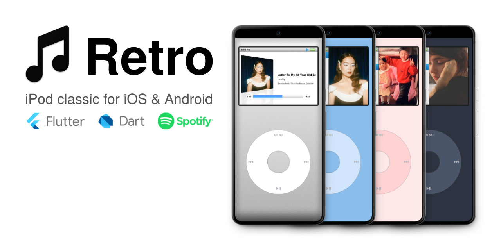

# About

[](https://discord.retromusic.co/)

Retro aims to bring back the iPod Classic experience to iOS and Android. Retro currently only works with Spotify. Apple Music support is ongoing with no planned release date.

# Installation

## iOS

If the [Testflight](https://beta.retromusic.co) is full you can [sideload](Sideloading.md) it.

## Android

Install the beta from the [Google Play Store](https://play.google.com/store/apps/details?id=co.retromusic.app2).

# Contribute & Build from Source

## Stack

* Flutter/Dart for the main app
* Swift/SwiftUI for the WatchOS companion app (Retro Shuffle WIP)
* API: [Spotify SDK](https://github.com/brim-borium/spotify_sdk), [MusicKit](https://github.com/iberatkaya/playify)

## Getting Started

### Prerequisites

1. Download and install Flutter. You can find instructions [here](https://flutter.dev/docs/get-started/install).

### iOS Setup

1. Ensure you have an Apple Developer account (paid or free). You can find instructions [here](https://developer.apple.com/programs/enroll/).
2. Clone this repository.
3. Navigate to the project directory: `cd retro`
4. Open the `ios` folder in Xcode and select your Apple Developer account for signing. You may need to change the bundle ID.
5. Create a Spotify app [here](https://developer.spotify.com/dashboard/applications) and insert the Client ID and Redirect URIs in the `.env.example` file. Rename it to `.env`. The Redirect URI in your Spotify dashboard can be pretty much anything, e.g., comspotify://co.retromusic. Ensure the bundle ID in Xcode matches the one under iOS app bundles in the Spotify Dashboard.
6. In the terminal, run `flutter pub get && flutter run`.
7. The app should now run on your iOS device.

### Android Setup

1. Clone this repository.
2. Navigate to the project directory: `cd retro`
3. Create a Spotify app [here](https://developer.spotify.com/dashboard/applications) and insert the Client ID and Redirect URIs in the `.env.example` file. Rename it to `.env`. The Redirect URI in your Spotify dashboard can be pretty much anything, e.g., comspotify://co.retromusic.
4. Navigate to the `android` directory and generate an SHA1 Fingerprint with the following command: 
   ```sh
   keytool -list -v -keystore ~/.android/debug.keystore -alias androiddebugkey -storepass android -keypass android
   ```
(You will need to create one if you haven't already).

5. Under 'Android packages' in your Spotify dashboard, add the corresponding package/application ID and paste the SHA1 fingerprint generated in the previous step. The android package name can be found in the AndroidManifest.xml files in the android/app/src (debug, main, profile) directories. Ideally, change the package name to something unique. Defaults to co.retromusic.app2.
6. In the terminal, run `flutter pub get && flutter run`.
7. The app should now run on your Android device in debug mode.

## Contributing
Firstly, thank you for considering contributing 😁

- If you're fixing a bug, feel free to submit a PR and specify what you are fixing!
- If you believe something should be changed, open an issue here or discuss it on the [Discord](https://discord.retromusic.co) before making the change.

Other than that, there are no specific requirements. Your contributions are appreciated!